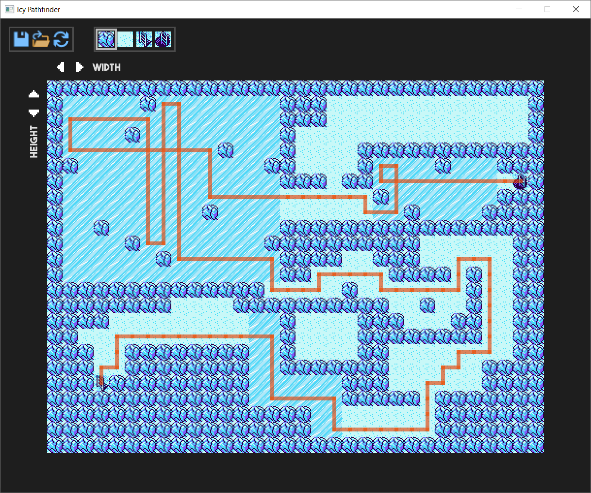

# Icy Pathfinder
A demonstrator of Dijkstra's algorithm navigating across an icy 2D surface. Finds the shortest and simplest paths between any start positions (ladders going up) and goal positions (ladders going down). On icy squares, the path must continue in the same direction until it reaches a wall.

Five types of squares are available: Icy squares (the default), obstacle squares, solid ground squares, start squares, and goal squares. Maps can be edited, resized, saved, or opened from files. Paths update in real-time as the map is modified.

Programmed in C++. Styled for cool 90s kids.

